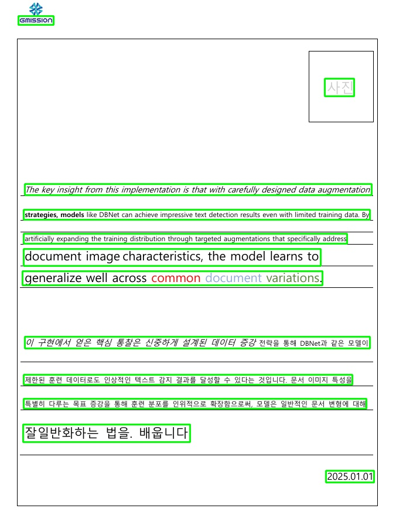
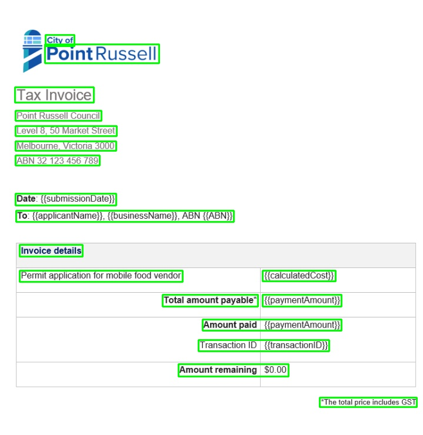

Text Detection inference code

### Test

* Run `python main.py` for testing

### Note

* This repo supports inference only, see reference for more details

### Results

### Weights
<!-- https://github.com/skconan -->
Download pretrained weights:
* [craftnet](https://drive.google.com/uc?id=1bupFXqT-VU6Jjeul13XP7yx2Sg5IHr4J)
* [refinenet](https://drive.google.com/uc?id=1xcE9qpJXp4ofINwXWVhhQIh9S8Z7cuGj)

#### Reference

* https://github.com/clovaai/CRAFT-pytorch

